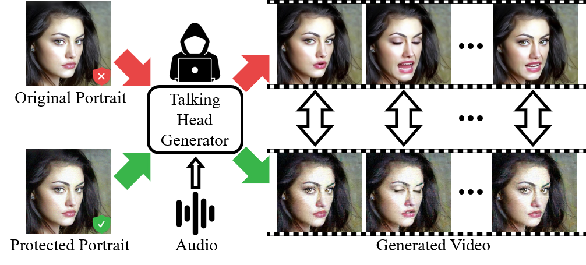

<div align="center">
    
# Silence is Golden: Leveraging Adversarial Examples to Nullify Audio Control in LDM-based Talking-Head Generation [CVPR 2025]

<a href="https://yuangan.github.io/"><strong>Yuan Gan</strong></a>
·
<a href="https://scholar.google.com/citations?user=kQ-FWd8AAAAJ&hl=zh-CN&oi=ao"><strong>Jiaxu Miao</strong></a>
·
<a><strong>Yunze Wang</strong></a>
.
<a href="https://scholar.google.com/citations?user=RMSuNFwAAAAJ&hl=en"><strong>Yi Yang</strong></a>

<a href="https://github.com/yuangan/Silencer"></a>

</div>
<div align="justify">

**Abstract**: Advances in talking-head animation based on Latent Diffusion Models (LDM) enable the creation of highly realistic, synchronized videos. These fabricated videos are indistinguishable from real ones, increasing the risk of potential misuse for scams, political manipulation, and misinformation. Hence, addressing these ethical concerns has become a pressing issue in AI security. Recent proactive defense studies focused on countering LDM-based models by adding perturbations to portraits. However, these methods are ineffective at protecting reference portraits from advanced image-to-video animation. The limitations are twofold: 1) they fail to prevent images from being manipulated by audio signals, and 2) diffusion-based purification techniques can effectively eliminate protective perturbations. To address these challenges, we propose **Silencer**, a two-stage method designed to proactively protect the privacy of portraits. First, a nullifying loss is proposed to ignore audio control in talking-head generation. Second, we apply anti-purification loss in LDM to optimize the inverted latent feature to generate robust perturbations. Extensive experiments demonstrate the effectiveness of **Silencer** in proactively protecting portrait privacy. We hope this work will raise awareness among the AI security community regarding critical ethical issues related to talking-head generation techniques.

## TODO:
- [ ] Environment setup.
- [ ] Release the code of Silencer-I.
- [ ] Release the metrics of Silencer.
- [ ] Release the code of Silencer-II.

## Silencer-I Setup & Preparation

### Environment Setup

```
cd Silencer-I
conda create -n silencer python=3.10
conda activate silencer
pip install -r requirements.txt
pip install .
```
Download the pretrained models from [hallo](https://github.com/fudan-generative-vision/hallo#-download-pretrained-models).

Download our preprocessed th1kh dataset from [Yandex](https://disk.yandex.com/d/OLe6c-cjGWiPgw).

These files should be organized as follows:
```
./Silencer-I/
|-- ...
|-- pretrained_models/
|   |-- ...
|-- th1kh/
|   |-- ...
```

### Run Silencer-I
```
CUDA_VISIBLE_DEVICES=3 python protect/protect_hallo.py attack.img_path='th1kh/th1kh_imgs_100' \
    attack.output_path='protect/out_th1kh_512/' attack.mode='hallo' attack.g_mode='-' attack.min_timesteps=200
```
### Test Protected Portraits of Silencer-I
Refer to [test_hallo_th1kh_hallo-.py]()
Useage example in [test_hallo_th1kh.sh]():
```
python test_hallo_th1kh_hallo-.py 0 0 &
python test_hallo_th1kh_hallo-.py 1 0 &
python test_hallo_th1kh_hallo-.py 2 0 &
python test_hallo_th1kh_hallo-.py 3 0 &
```

